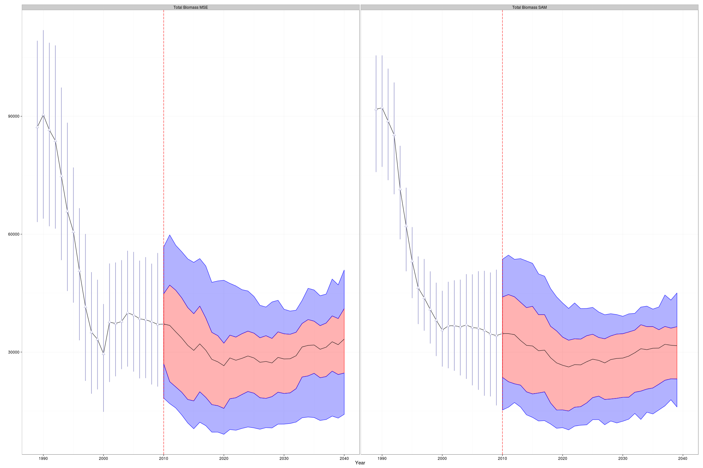

Management strategies for Patagonian Toothfish
========================================================
author: Chapter 3 -- Paper I
date: May, 2015
width: 1440
height: 900
transition: concave
font-import: http://fonts.googleapis.com/css?family=lato
font-family: 'lato'

Chilean Case
========================================================

For more details on authoring R presentations click the
**Help** button on the toolbar.

- Bullet 1
- Bullet 2
- Bullet 3

First Results
========================================================
Comparison between Stock Assessment Model (**SAM**) and Operating Model (**MSE**):

First Results
========================================================
Comparison between Stock Assessment Model (**SAM**) and Operating Model (**MSE**):

Slide With Plot
========================================================

 
